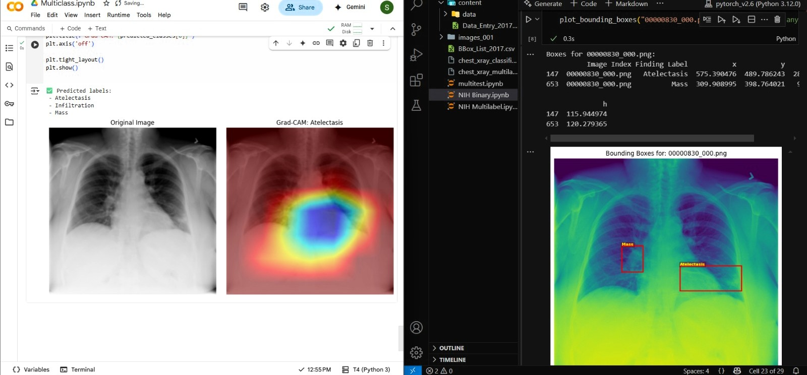
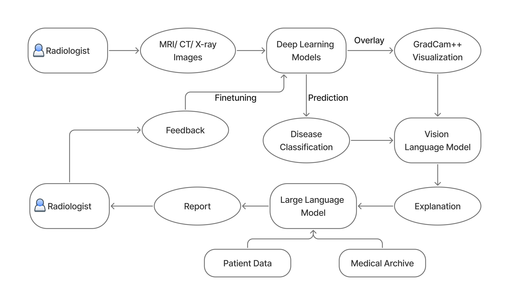

# Medi-Mitra

## Overview
We have uploaded demo scripts of training and explainable AI part, you can see that the architecture we promise is possible and completely practicle.
This project presents a scalable, intelligent medical imaging assistant powered by a **three-model pipeline** to support both **radiologists** and **patients**. It automates disease detection, generates explainable visual and textual diagnostics, and enables multilingual, source-grounded health consultations.

---

## 🚀 Tri-Model Architecture

Our architecture is structured into three synergistic components:

### 1. **CNN-Based Disease Detection**

* **Model:** Convolutional Neural Networks (Deeplearning)
* **Dataset:** NIH ChestX-ray14
* **Function:** Classifies over **14 chest-related diseases**.
* **Output:** Disease labels with confidence scores and Grad-Cam Overlay.
* [Check the training notebook](./Training%20Scripts/Multiclass.ipynb)

### 2. **Vision-Language Model (LLaMA 4 Scout)**

* **Model:** LLaMA 4 Scout (custom VLM)
* **Input:** Medical scan + CNN output
* **Function:** Extracts and explains:

  * **Disease locations**
  * **Shape & size of anomalies**
  * **Visual marker reasoning**
* **Explainability:** Integrated with **GradCAM, GradCAM++, and Layered Vision** for heatmap overlays.
* [Check the Demo here](./Explanable%20AI/explain.ipynb)

### 3. **LLM-Based Report Generator**

* **Model:** Gemini / OpenAI LLMs.
* **Input:** CNN predictions + Grad-Cam + patient data
* **Function:** Generates:

  * Structured **clinical reports**
  * **Differential diagnosis**
  * Exportable, human-readable **medical summaries**
---

# Flowchart

---

## ⚙️ Tech Stack

| Component       | Technology           |
| --------------- | -------------------- |
| ML Frameworks   | PyTorch / TensorFlow |
| Vision-Language | LLaMA 4 Scout        |
| Language Model  | Gemini/OpenAI        |
| Dataset         | NIH ChestX-ray14     |
| Frontend        | React.js             |
| Backend         | Flask                |
| Database        | MySQL                |
| GraphRAG        | Neo4j                |

---

## 📦 Key Features

* 🔍 **14+ disease detection**
* 🧠 **Explainable AI** via GradCAM overlays
* 🗣️ **Human-like explanations** of scan findings
* 🧾 **Automated, structured report generation**
* 💬 **Chatbot** for patients with GraphRAG for grounded responses
* 🌐 **Multilingual disease archive**
* 📊 **Radiologist dashboard** for triage and stats
* 🔄 **Self-improving pipeline** using real-time feedback

---

